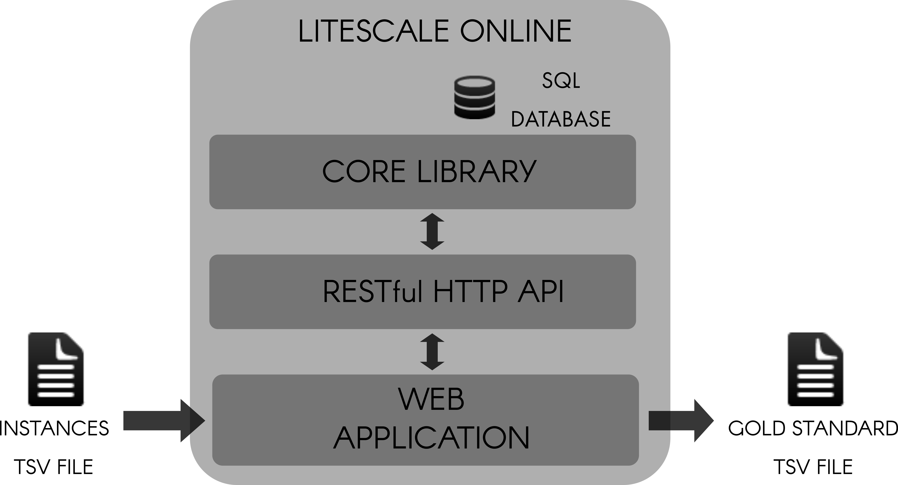
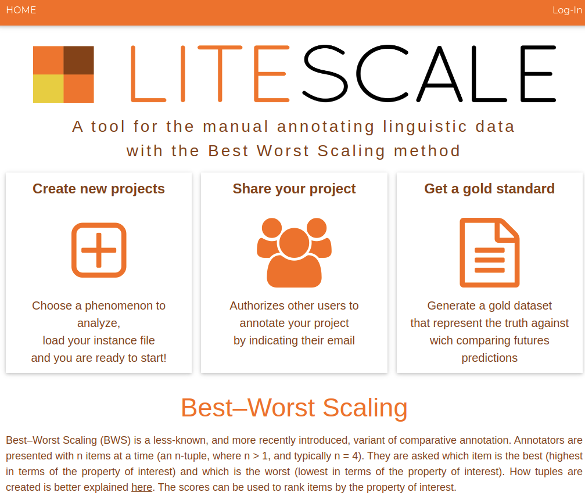
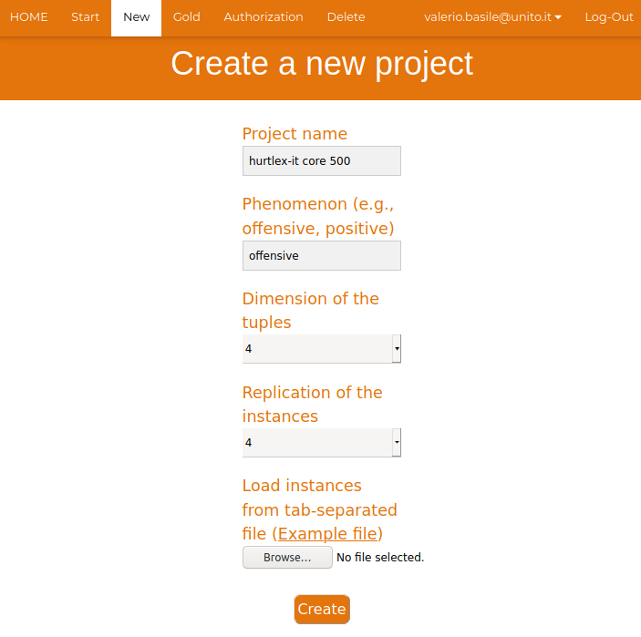
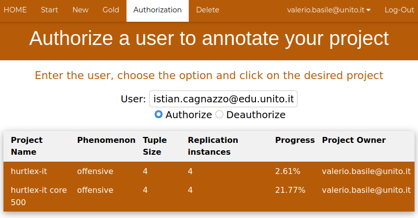
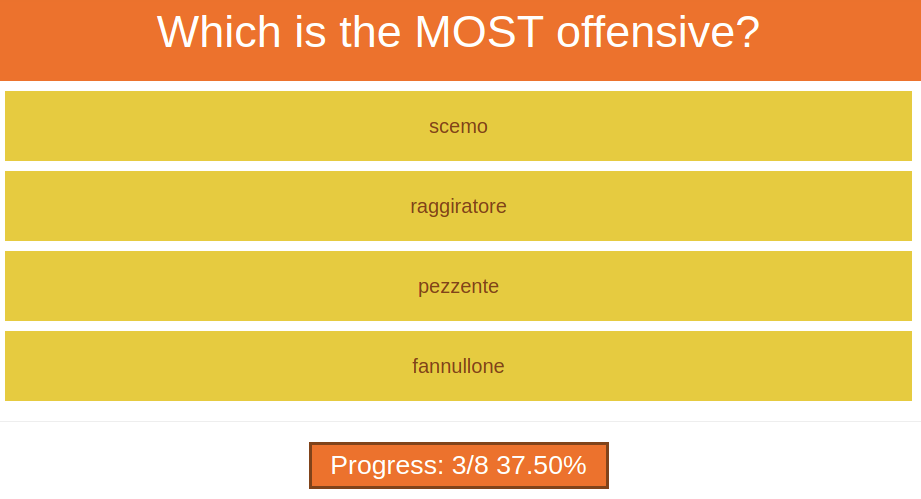
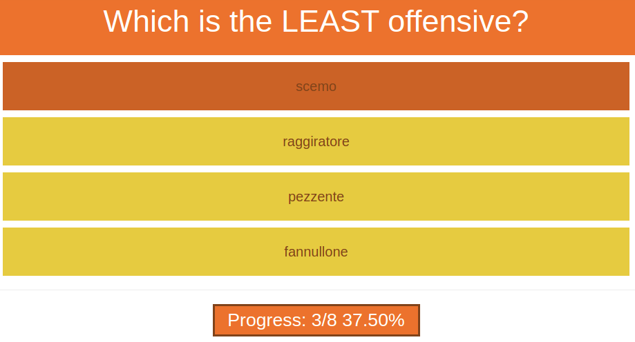

# litescale-web

  

_A Web application for Best-worst Scaling annotation based on the [Litescale](https://github.com/valeriobasile/litescale) standalone library_

---

Best-worst Scaling (BWS) is a methodology for annotation based on comparing and ranking instances, rather than classifying or scoring individual instances. LITESCALE is a free software library to create and manage BWS annotation tasks. It computes the tuples to annotate, manages the users and  the annotation process, and creates the final gold standard. 

LITESCALE-WEB is a fully online version of Litescale with multi-user support implemented with the _Flask_ Python framework. A RESTful HTTP API is provided  in order to expose the core library functionalities, and a Web application provides the user interface by connecting to the API.

This project was implemented for my bachelor thesis in Computer Science at the University of Turin. 

Litescale and Litescale Web are described in more detail in the following paper 
[Litescale: A Lightweight Tool for Best-worst Scaling Annotation](https://aclanthology.org/2021.ranlp-1.15) (Basile & Cagnazzo, RANLP 2021).

## Architecture

### RESTful HHTP API

| _Method_ | _Endpoint_        | _Description_          |
|-----------------|--------------------------|-------------------------------|
| POST            | _/users_         | Creates a user                |
| DELETE          | _/users_         | Deletes a user                |
| GET             | _/projectList_   | Retrieve the list of projects of a user                     |
| GET             | _/projects_      | Retrieves the properties of a project                     |
| POST            | _/projects_      | Creates a project             |
| DELETE          | _/projects_      | Deletes a project             |
| GET             | _/tuples_        | Retrieves the tuples of  a project                     |
| POST            | _/annotations_   | Creates a new annotation      |
| GET             | _/gold_          | Generates the gold standard   |
| GET             | _/progress_      | Returns the current progress  of an annotation task         |
| POST            | _/authorizations_| Adds a user to a project      |
| DELETE          | _/authorizations_| Removes a user from a project |

### Web Application 
##### Homepage

#### Main Features

- **Creation** of a new annotation project

- Management of user **authorization** on projects (the owner of a project can invite other users to join their projects)

- **Annotation** process: the annotator is asked to select the instance from the tuple which expresses the phenomenon to the maximum extent, and the one that expresses it to the least extent

- Generation of the **gold standard** file with the score indicating the relevance of the phenomenon object of the annotation project in each instance

| Id | Instance        | Score |
|----|--------------|-----|
| 10 | scemo        | 1.0 |
| 8  | porco        | 1.0 |
| 6  | pezzente     | 0.8 |
| 3  | raggiratore  | 0.8 |
| 11 | tirchio      | 0.8 |
| 2  | porcello     | 0.6 |
| 1  | qualunquista | 0.4 |
| 4  | scellerato   | 0.4 |
| 9  | tonto        | 0.4 |
| 7  | fannullone   | 0.4 |
| 5  | severo       | 0.0 |

